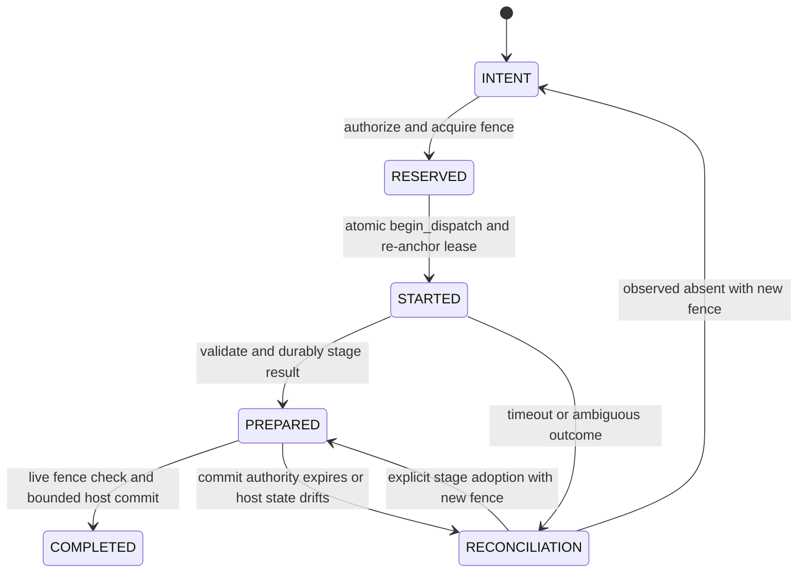

# Task 5 Dispatch Authority Design

**Date:** 2026-08-15
**Status:** Approved approach A1; written specification pending human review
**Scope:** Capability Broker worker timing authority only

## 1. Problem

Task 5 currently creates the attempt lease and the grant deadline during
authorization. Snapshot construction, source revalidation, Lima attestation, and
other bounded pre-dispatch work then consume that lifetime. A worker may finish
inside its full policy timeout but still lack the reserved commit budget, forcing
a false `PREPARED` reconciliation.

The defect is not the size of the configured timeout. It is that one timestamp
serves two different authorities:

- the grant authorizes whether an attempt may start; and
- the attempt lease authorizes how long an already-started worker may execute,
  commit, terminate, verify, or roll back.

Those lifetimes must be separated without weakening fencing, live approval
checks, `PREPARED` recovery, or the worker subprocess timeout.

## 2. Selected Approach: A1

Keep the existing persisted attempt/lease row and fence, but atomically re-anchor
its runtime lifetime when the effect enters `STARTED`. Do not add a second lease
table.

- The immutable `Grant` remains the admission artifact. Its expiry determines
  whether dispatch may begin; it does not become the runtime deadline.
- A journal-owned **Execution Authority** begins at the transactionally observed
  `STARTED` time. It reuses the same attempt owner and fence.
- Its expiry is derived from the full worker policy timeout plus the existing
  bounded termination and commit budgets.
- After `STARTED`, commit validates the immutable grant bindings and live
  run/policy/approval/release state, but temporal authority comes only from the
  current fenced journal lease.

This is a lifecycle separation, not a permission expansion. The worker still
receives exactly the policy timeout and no additional subprocess runtime.

### 2.1 Alternatives Rejected

1. **Reissue the whole grant immediately before dispatch.** This duplicates an
   approval-bound artifact and leaves another timing window between reissue and
   process start.
2. **Create a separate persisted commit-lease table.** This gives explicit data
   separation but introduces a second owner/fence reconciliation problem and an
   unnecessary schema migration.
3. **Accept reconciliation near the timeout boundary.** This treats successful
   work as ambiguous, wastes retries and review budget, and violates the worker
   timeout contract.

## 3. Authority Model

### 3.1 Admission Grant

The grant continues to bind the request, policy, Workflow Release, approval,
run/revision/state, resource, exact command and snapshot digests, task
fingerprint, effect, owner, and fence. Dispatch admission requires:

- a valid immutable grant digest issued by this broker;
- an unexpired admission deadline;
- the same live Workflow Release, policy, approval, run revision/state,
  resource, exact command, and source snapshot;
- the same journal attempt owner and fence; and
- a dispatchable effect state.

Grant expiry after a successful `STARTED` transaction does not by itself revoke
the running attempt. Live approval, release, policy, run, resource, or fence
drift still denies commit.

### 3.2 Execution Authority

`Journal.begin_dispatch(...)` is the only operation that creates runtime timing
authority. In one `BEGIN IMMEDIATE` transaction it:

1. advances the durable clock watermark;
2. verifies run revision/state, effect state, lease owner, and fence;
3. verifies that the admission grant is still valid at the observed start time;
4. records `STARTED` exactly once; and
5. replaces the same attempt lease expiry with
   `started_at + worker_runtime_budget + commit_budget`.

It returns an in-process frozen `ExecutionAuthority` containing the run/effect,
owner, fence, `started_at`, worker deadline, commit deadline, lease expiry, and
a digest over those values plus the grant ID. The persisted authority is the
existing `STARTED` effect plus the re-anchored owner/fence/expiry lease row; the
derived value is not a new database record and no value is supplied by the
worker.

`begin_dispatch` is deliberately non-replayable. It accepts only `INTENT` under
the current reservation. A repeat after `STARTED` returns reconciliation
required and cannot launch another process, even when the grant and fence are
unchanged.

`RESERVED` is a conceptual phase represented by the existing attempt lease and
grant; it is not a new effect state or schema value.

## 4. Timing Budget

The timing budget has one canonical derivation used by broker, launcher, and
tests:

- `worker_timeout`: the policy value passed unchanged to the subprocess;
- `termination_budget`: bounded TERM/KILL and reap time;
- `commit_budget`: bounded preparation, apply, verification, termination, and
  rollback time already enforced by Task 5; and
- `execution_lease_ttl = worker_timeout + termination_budget + commit_budget`.

The worker deadline is `started_at + worker_timeout`. The commit deadline and
lease expiry are later only to finish bounded verification, cleanup, or
rollback. They do not authorize additional worker execution.

All deadline comparisons use the journal's durable clock/watermark rules. A
broker wall-clock rollback cannot extend an authority.

## 5. Dispatch and Commit Flow

1. Authorization validates the request and reserves the attempt/fence.
2. The controller builds and revalidates the bounded source snapshot and live VM
   authority.
3. Immediately before process creation, the broker calls `begin_dispatch`.
4. Only a committed `ExecutionAuthority` may be passed to the process runner.
5. Timeout enforcement uses the worker deadline, not grant expiry or lease
   expiry.
6. Result validation writes `PREPARED` before host mutation.
7. Final commit verifies live release, policy, approval, run, owner/fence, and
   sufficient execution-lease TTL immediately before bounded mutation.
8. Only exact expected-after state may become `COMPLETED`; ambiguity remains
   `STARTED` or `PREPARED` for typed reconciliation.

Prepared-stage adoption does not launch a worker. A newly authorized owner/fence
uses a journal transaction that anchors only the bounded commit authority before
adopting and applying the existing content-addressed stage.

## 6. Failure and Recovery Rules

- Grant expires before `begin_dispatch`: deny; do not record `STARTED` or launch.
- Reservation owner/fence changes before `begin_dispatch`: deny.
- Crash before the `STARTED` commit: no process may have started.
- Crash after `STARTED` but before process creation: reconciliation observes no
  external worker effect and may return to `INTENT` under a new fence.
- Worker exceeds its policy timeout: cancel and retain ambiguous `STARTED` until
  reconciliation proves an outcome.
- Grant admission deadline expires after `STARTED`: running work may finish;
  final live binding and execution-lease checks still apply.
- Execution lease or commit reserve expires: do not mutate host state; retain
  durable `PREPARED` evidence for reconciliation or explicit adoption.
- Old-fence completion, cancellation, or adoption is always rejected.

## 7. Interface Changes

- Add frozen, derived `ExecutionAuthority` as a journal/broker boundary value;
  do not persist a second authority record.
- Add `Journal.begin_dispatch(...) -> ExecutionAuthority` with atomic STARTED and
  lease re-anchoring semantics.
- Split grant validation into admission-time validation and immutable/live
  binding validation. Runtime commit must not reuse admission expiry as its
  deadline.
- Pass `ExecutionAuthority` through broker dispatch and worker result commit;
  worker processes never receive or control it.
- Reuse the existing lease schema and fence. No schema version change is
  required unless implementation evidence proves the current row cannot encode
  the re-anchored expiry; that result is an architecture blocker, not permission
  to add an undocumented migration.

## 8. Acceptance Evidence

Tests must first fail against the current implementation and then prove:

1. non-zero snapshot/attestation delay plus near-policy-timeout success commits;
2. the subprocess still receives exactly the policy timeout;
3. grant expiry before `STARTED` denies without launching;
4. grant expiry after `STARTED` alone does not invalidate a live fenced attempt;
5. policy, approval, Workflow Release, run, resource, owner, or fence drift still
   denies commit;
6. `begin_dispatch` replay after durable `STARTED` requires reconciliation and
   cannot start the process twice;
7. clock rollback does not extend execution authority;
8. crash before/after `STARTED`, worker timeout, PREPARED lost-ACK, mixed host
   state, and new-fence adoption preserve existing recovery semantics; and
9. Task 1-5 regression, schema/runtime parity, Ruff, format, and diff checks pass.

No paid Lima/model smoke is required unless implementation changes VM launch,
permission profiles, mount attestation, credential isolation, or network
isolation. The A1 boundary is journal/broker timing authority.

## 9. Non-Goals

- extending worker subprocess runtime;
- adding ambient permissions, credentials, or network access;
- changing the 24 MiB snapshot bound;
- weakening PREPARED, fence, rollback, or reconciliation rules;
- adding generic lease renewal for arbitrary external effects; or
- beginning Task 6 model routing or budget accounting.
